### FlashArray GUI
First, we need to create two LACP virtual interfaces. Begin by identifying the groups of physical Ethernet ports to be used for the new LACP virtual interfaces. All selected ports must reside on the same controller. Ensure that these physical Ethernet ports are not already in use by management services, another bond, or subnet configuration. Additionally, the selected ports must have the same MTU value.

Navigate to the `Settings/NETWORK/Connectors` configuration page to review the available physical Ethernet ports.

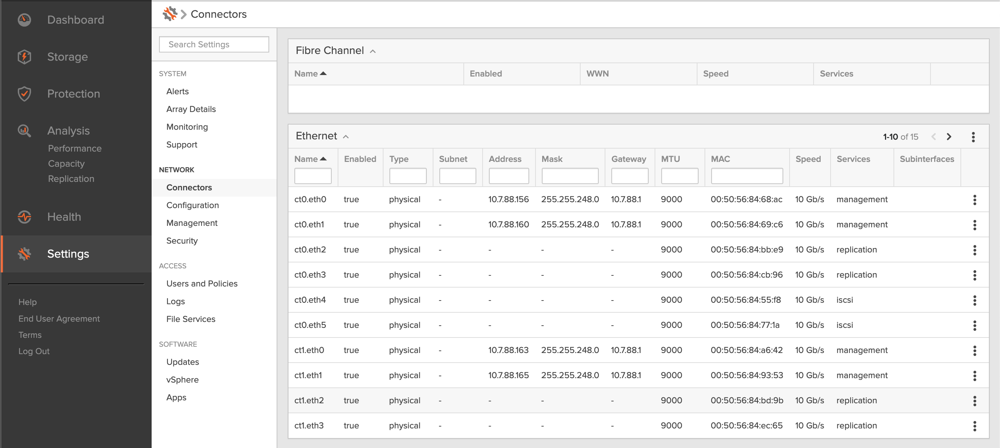

In this example, we will use the `ct0.eth4` and `ct0.eth5` ports. Right-click on the Ethernet widget's menu and select the `Create LACP Bond` option.

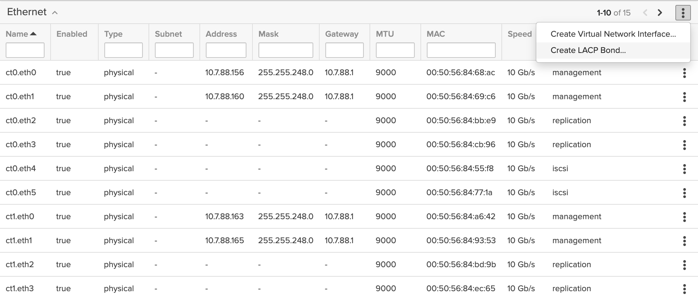

In the `Create LACP Bond` dialog, enter the `Name`, then click the edit icon next to the `Subinterfaces` field.

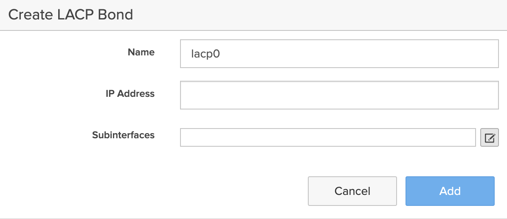

Select the `ct0.eth4` and `ct0.eth5` physical Ethernet ports.

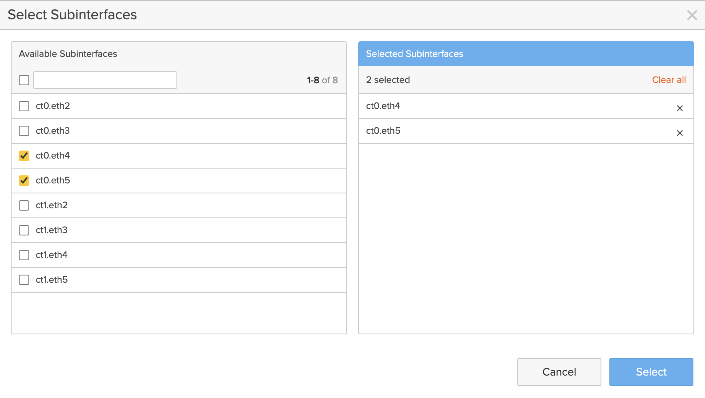

Click the `Select` button in the dialog, then click the `Add` button in the previous dialog.

Repeat the process for the `ct1.eth4` and `ct1.eth5` physical Ethernet ports to create the `lacp1` LACP bond.

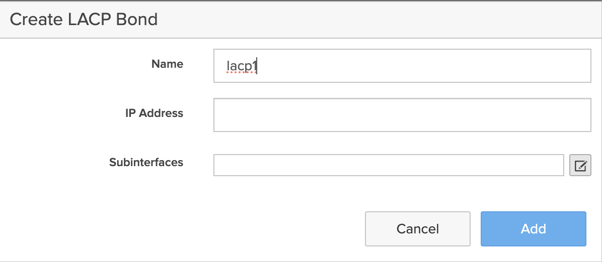
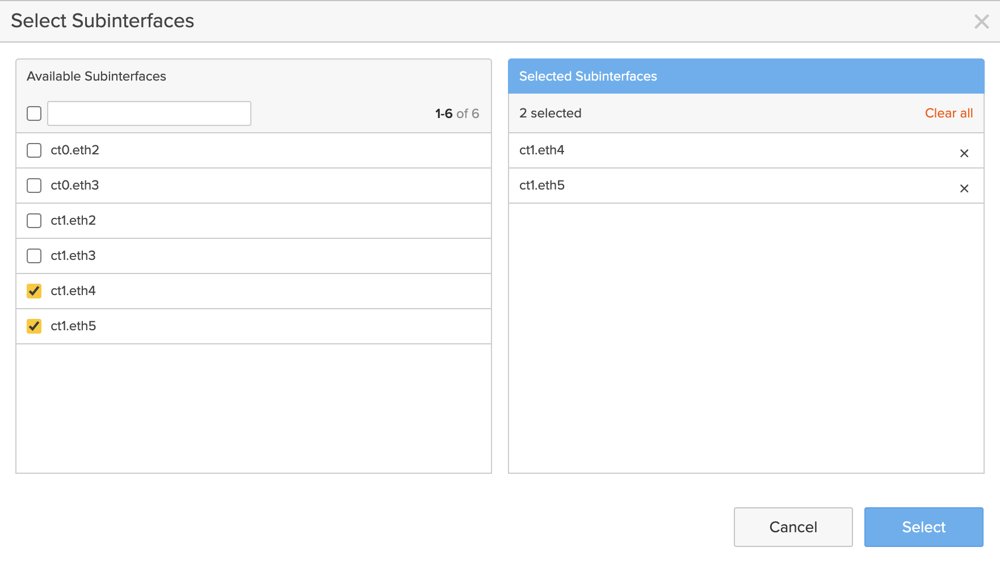

Navigate to the `Settings/NETWORK/Connectors` configuration page to enable the newly created LACP bonds.

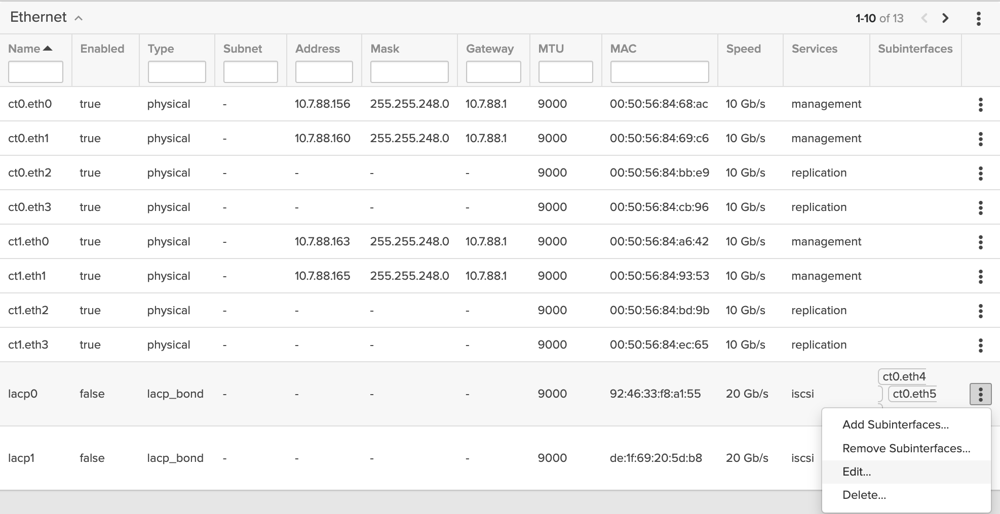

Enable both `lacp0` and `lacp1` LACP bonds. You don’t need to fill in any other values; simply set the `Enabled` radio button.

Enable `lacp0`:

and `lacp1`:

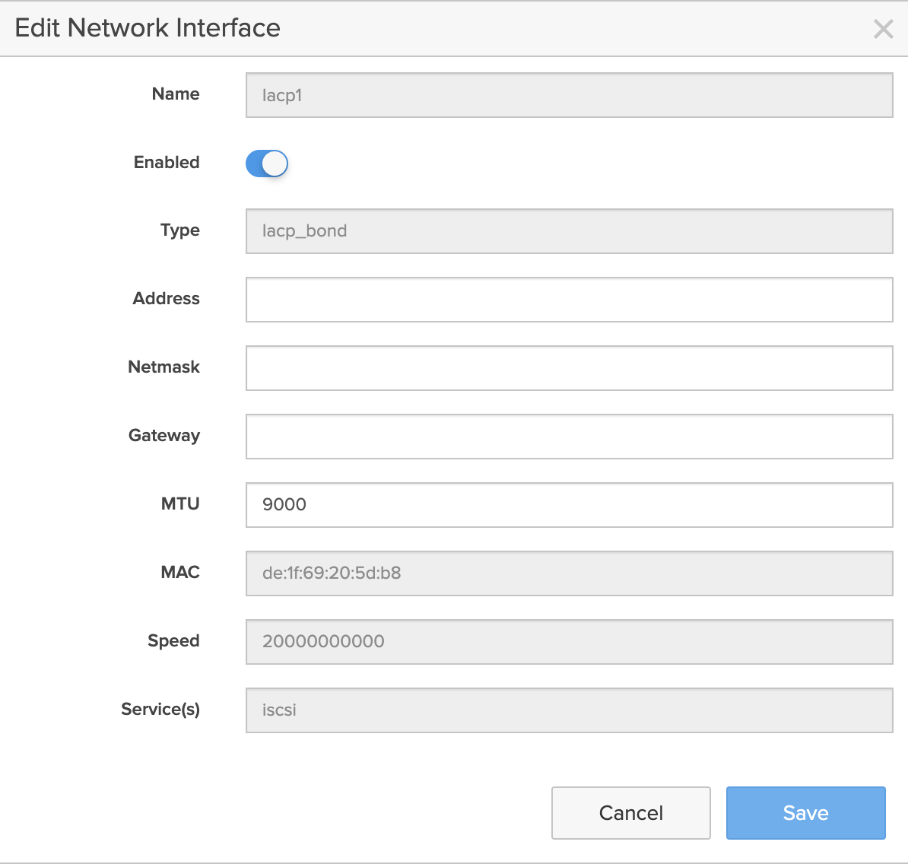

Now, we’ll create a new file virtual interface using the LACP bonds.

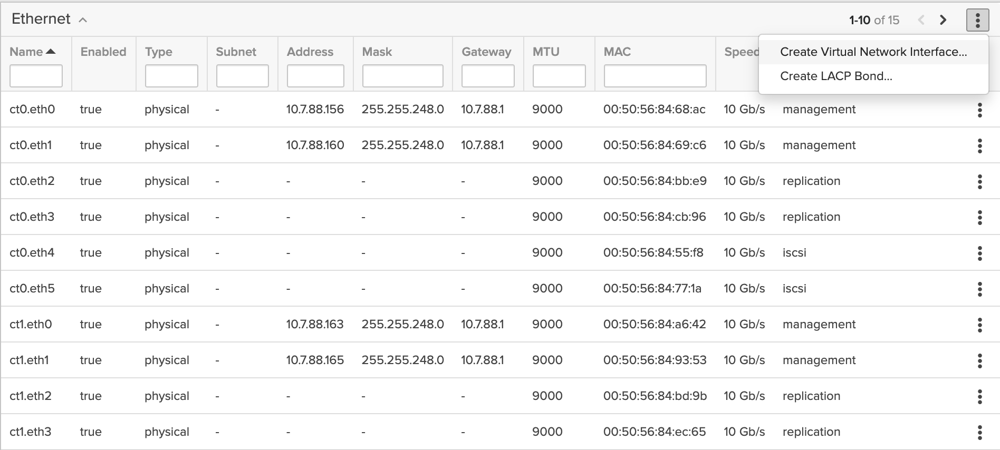

In the `Create Virtual Network Interface` dialog, enter the `Name` and `IP Address`, then click the edit icon next to the `Subinterfaces` field.

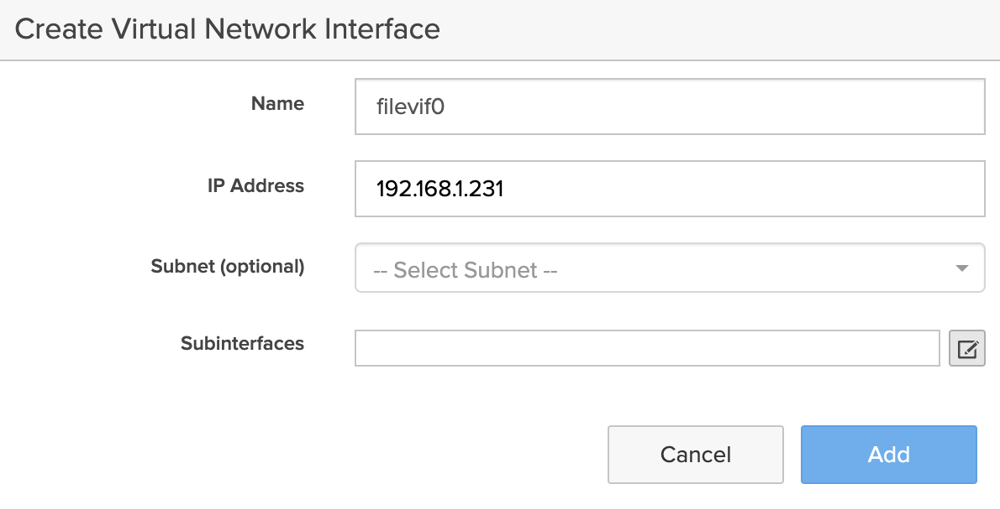

Select the `lacp0` and `lacp1` LACP bonds.

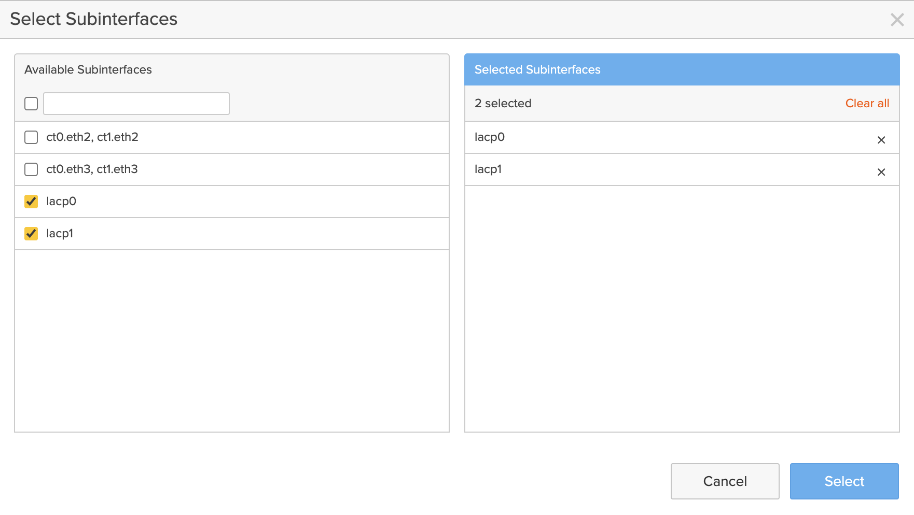

Click the `Select` button in the dialog, then click the `Add` button in the previous dialog.
