# Creating Virtual File Interface using VLANs in GUI
Virtual LAN (VLAN) tagging is a networking technology that allows for the logical division of a network into multiple virtual networks, called VLANs, to improve network security, performance, and flexibility.

In FlashArray, VLANs are represented by subnets. You can create a new subnet from the `Subnets` widget on the `Settings/NETWORK/Configuration` page 

by clicking on the `+` button.

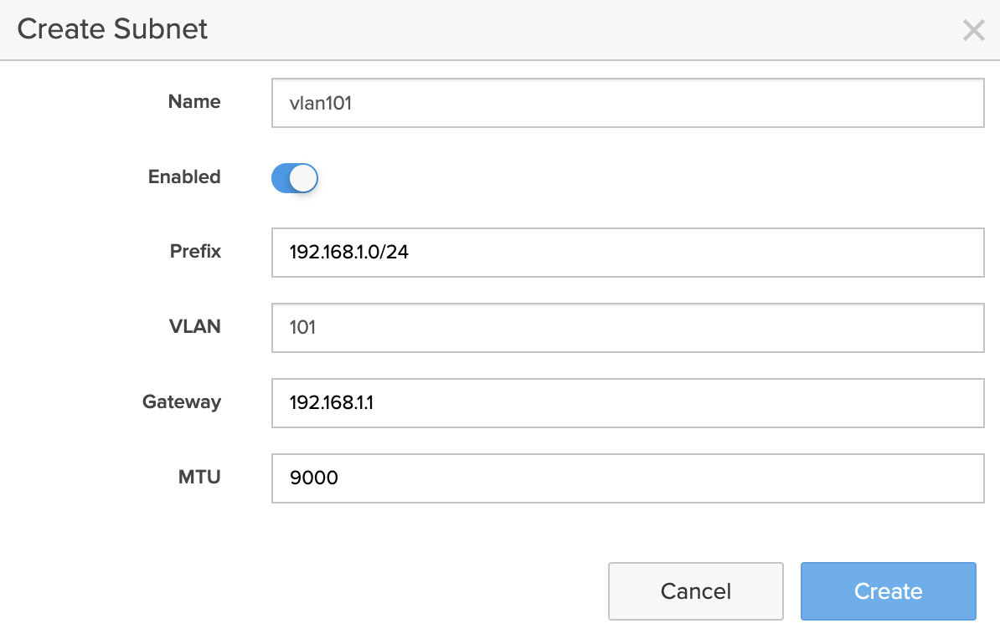

Once the VLAN subnet is created, you need to add physical Ethernet interfaces to the subnet by clicking on the `Add interface +` button.

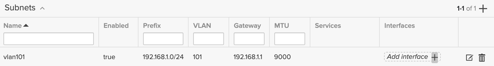

that invokes this dialog 

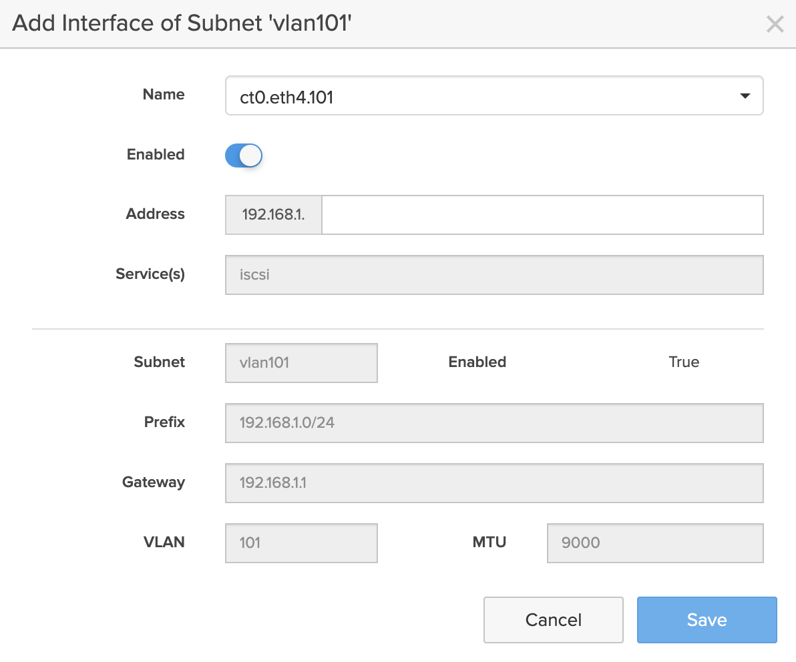

where you need to add the last component of the IP address. 

You need to do this for all interfaces that you plan on using for the file virtual interface. In our case this `ct0.eth4.png`,`ct1.eth4.png`,`ct0.eth5.png`, and `ct1.eth5.png`

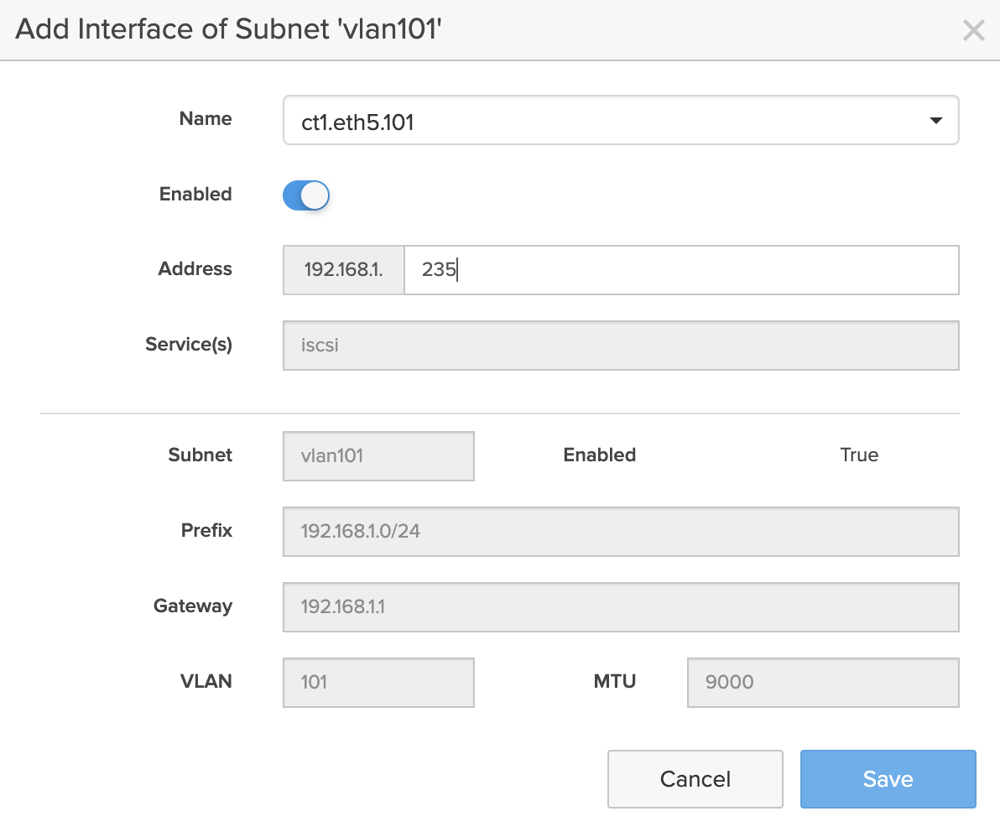

You can see the new VLAN virtual interfaces in the `Ethernet` widget on the `Settings/NETWORK/Connectors` page. Now you can use these virtual interfaces for the file virtual interface creation. 

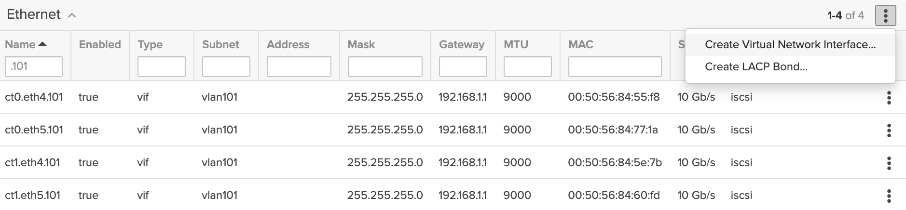

Click on the `Create Virtual Network Interface` menu item and fill the new file virtual network details

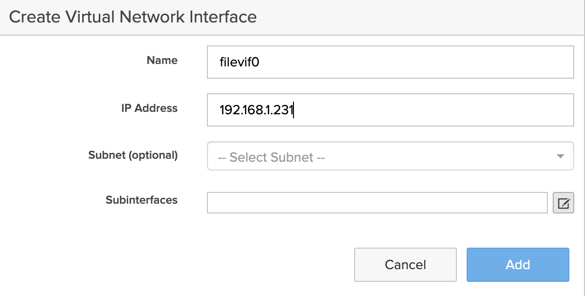

Then select the VLAN virtual interfaces in the `Select Subinterfaces` dialog

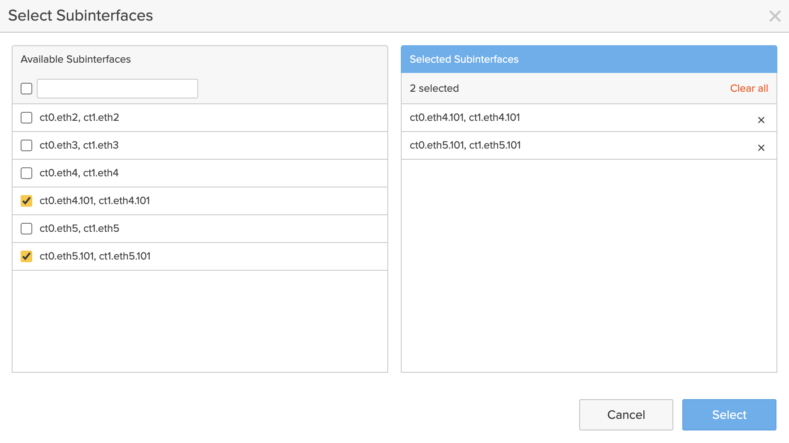

Click the `Select` button in the dialog, then click the `Add` button in the previous dialog.

Find the new `filevif0` file virtual interface in the `Settings/NETWORK/Connectors` page and click the `Edit` button.

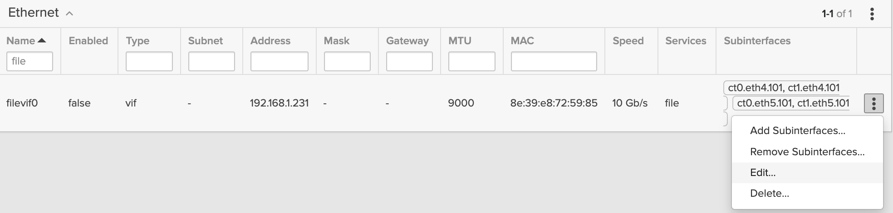

Specify the `Netmask` and `Gateway` values, and enable the new file virtual interface.

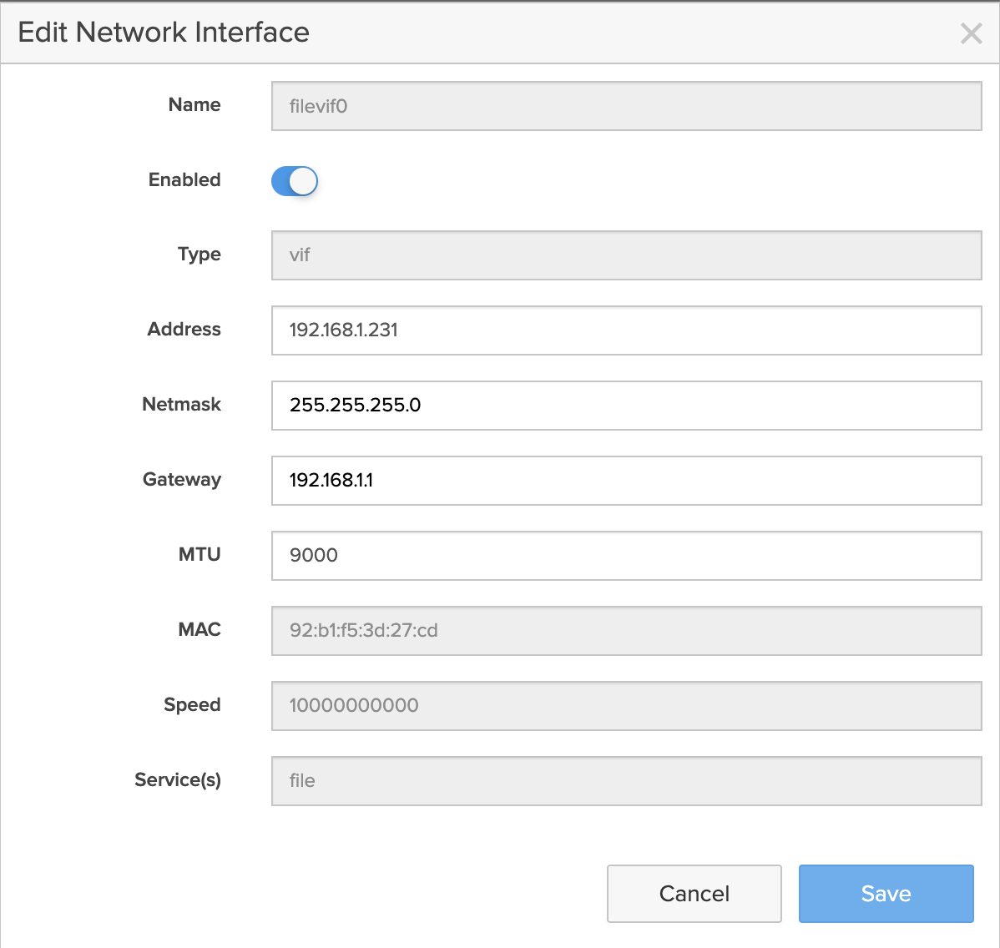

If you no longer need the file virtual interface, you can delete it by clicking the `Delete` command in the Ethernet list.

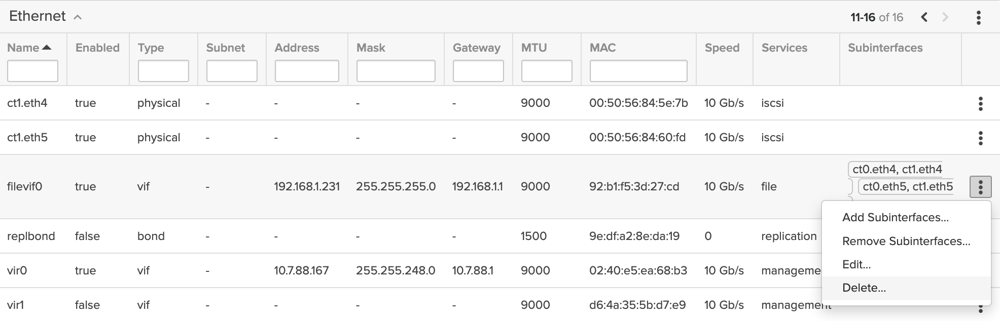

Then you can also delete the VLAN virtual network interfaces by clicking on the `x` button of a specific interface in the `Subnet` widget on the `Settings/NETWORK/Configuration` page.

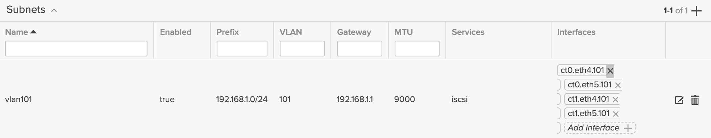

