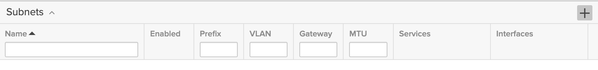

# Creating a Virtual File Interface using VLANs in the GUI

Virtual LAN (VLAN) tagging is a networking technology that allows for the logical division of a network into multiple virtual networks, called VLANs, to improve network security, performance, and flexibility.

In FlashArray, VLANs are represented by subnets. You can create a new subnet from the `Subnets` widget on the `Settings/NETWORK/Configuration` page:

Click on the `+` button to add a new subnet.

Once the VLAN subnet is created, you need to add physical Ethernet interfaces to the subnet by clicking the `Add interface +` button:

This will open the following dialog:

Here, you need to specify the last component of the IP address for the interface.

You will need to repeat this process for all interfaces you plan to use for the file virtual interface. In our example, these are `ct0.eth4.png`, `ct1.eth4.png`, `ct0.eth5.png`, and `ct1.eth5.png`.

You can now see the new VLAN virtual interfaces in the `Ethernet` widget on the `Settings/NETWORK/Connectors` page. These virtual interfaces are ready to be used for creating a new file virtual interface.

To create the virtual network interface, click on the `Create Virtual Network Interface` menu item and fill in the details for the new file virtual network interface.

Next, select the VLAN virtual interfaces in the `Select Subinterfaces` dialog:

Click the `Select` button in the dialog, then click the `Add` button in the previous dialog.

Find the new `filevif0` file virtual interface in the `Settings/NETWORK/Connectors` page and click the `Edit` button.

Specify the `Netmask` and `Gateway` values, and enable the new file virtual interface.

If you no longer need the file virtual interface, you can delete it by clicking the `Delete` command in the Ethernet list.

You can also delete the VLAN virtual network interfaces by clicking the `x` button next to a specific interface in the `Subnets` widget on the `Settings/NETWORK/Configuration` page.

