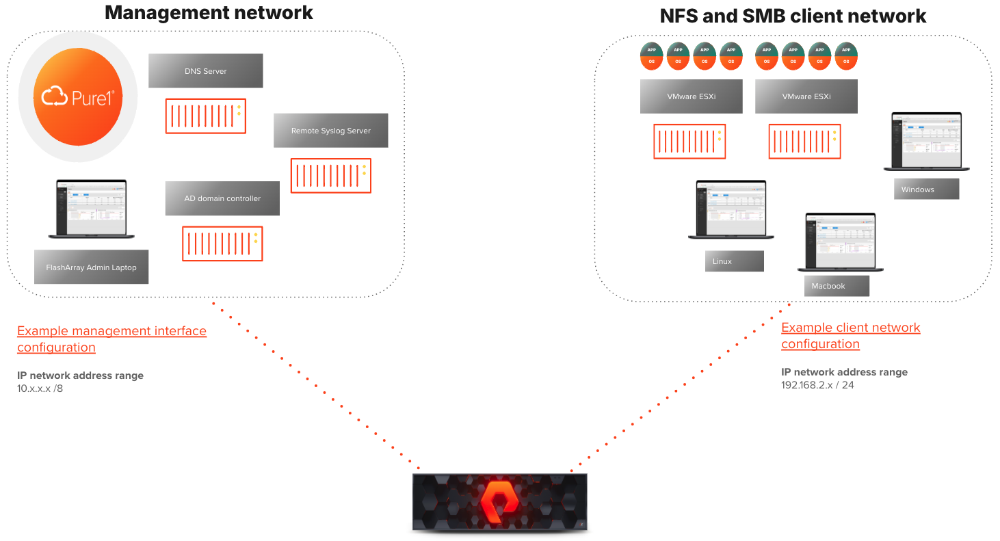

# DNS Best Practices

By default, FlashArray sends domain name lookup requests via the management network interfaces, specifically through the `eth0` Ethernet network port, rather than the File Services virtual interface. While the File Services virtual interface can be used to route DNS lookups, it is not recommended.

As a best practice, Pure Storage recommends that client traffic to the FlashArray be routed over a separate IP network from management traffic. For example, the configuration below uses two different IP networks: one for NFS and SMB traffic (`192.168.2.x`) and the other (`10.x.x.x`) for management. The DNS server must be accessible from the `10.x.x.x` network but does not need to be accessible from the `192.168.2.x` network.



Regardless of which interface is being used for DNS services, that interface must be able to reach the DNS server. You can test whether DNS services are correctly configured and available by running the following command:

```bash
puredns lookup <hostname>
If it returns an IP address, DNS services have been correctly configured.
```