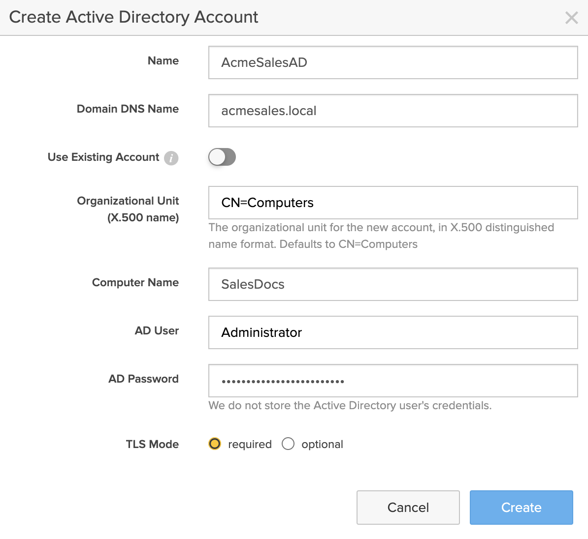
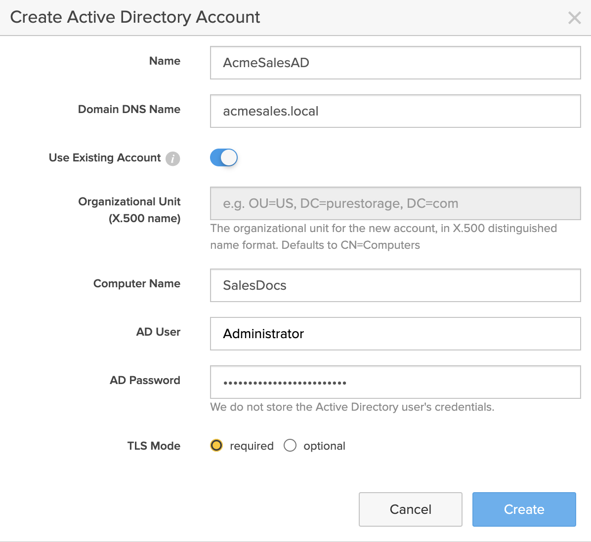

# Joining Active Directory Domain

FlashArray can authenticate SMB and NFS users against an Active Directory domain. To do this, you must first create an account for the FlashArray in your target Active Directory domain.

You can either create a new computer account for your array:

or use an existing computer account in your Active Directory:

