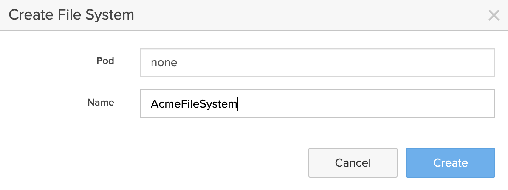

# Creating the First Share

Once you've set up File Services, you can start sharing your directories over SMB or NFS protocols. Here are the high-level steps you need to follow:

- **Create a File System**: The container for the files and directories that you're going to share.
- **Create an export policy**: The configuration for your SMB or NFS sharing over the network.
- **Create an export**: The representation of a directory that is shared over the network via SMB or NFS protocols.
- **Set SMB share permissions**: to define access to the shared directory.  
- **Access the SMB share or NFS export from your clients**: map (Windows) or mount (Unix/Linux) the shared directory from a remote client computer over SMB or NFS protocols. 

## Multi-Protocol Access

FlashArray supports simultaneous access from both SMB and NFS clients to the same directory. This means you can have Windows users accessing files via SMB, and Linux users accessing the same files via NFS.

The array manages permissions and access control by mapping SMB ACLs to Unix mode bits (and vice versa), ensuring smooth interoperability. However, it's important to plan your file permissions carefully to avoid conflicts between the two access models.

## Create a New File System

Creating a File System is the first step that you need to perform before sharing files. A File System is the primary storage container where your files are going to be stored. You can think of it as a disk or, more precisely, a disk partition. You can create a new File System via CLI or GUI.

### Creating a New File System via CLI

You can perform many operations on your File System using the `purefs` command. For example, you can create a new File System using: 

```bash
purefs create AcmeData
```

Later, you can list all File Systems using: 

```bash
purefs list 
```

Or remove your File System using:

```bash
purefs destroy AcmeData 
```

Please note that FlashArray uses a two-phase deletion process for removing many block and file artifacts. We call this process destroy/eradicate, and you can think of the destroy command as dumping the File System to a recycle bin. Later, you can restore your File System from the recycle bin via the `purefs recover` command or permanently delete a destroyed File System using the `purefs eradicate` command. 

The `purefs list` command lists all available File Systems on your array. 

### Creating a New File System via GUI

To create a new File System using the FlashArray GUI, follow these steps:

1. Navigate to your FlashArray's hostname or management IP address and log in with your credentials.
2. In the left-hand navigation pane, click on **Storage** and **Go to the"File Systems" Tab** 
3. **Click on "+" button in the File Systems Widget**



4. Enter a name for your new File System (e.g., `AcmeFileSystem`).
5. **Click "Create"**: Your new File System will now be available for use.

## Create Managed Directory

Managed directories allow administrators to control the organization and structure of directories under a File System. With FlashArray, you can create, manage, and set policies for directories in a way that scales efficiently. 

### Key Considerations for Managed Directories

- Managed directories **are not case-sensitive**, making them more flexible in environments with mixed case usage.
- You can have **up to 8 levels** of directory hierarchy, though many customers often use only a single level.
- Managed directories offer **fine-grained control** over file system organization and access.
- There is a default `:root` managed directory that gets automatically created when the File System is created.

### Creating a New Managed Directory via CLI

To create a managed directory within a File System, use the following command:

```bash
puredir create --path /home AcmeFileSystem:home
```

This will create a new managed directory named `home` within the `AcmeData` File System.

To list all managed directories in a File System:

```bash
puredir list
```

**NOTE**: Notice the `AcmeFileSystem:root` managed directory that has been created automatically upon the `AcmeFileSystem` File System creation. 

To remove a managed directory:

```bash
puredir delete AcmeFileSystem:home
```

### Creating a New Managed Directory via GUI

1. In the left-hand navigation pane, click on **Storage** and **Go to the"File Systems" Tab**
2. **Click on "+" button in the Directories Widget** to create a new Managed Directory.
3. **Specify the new Managed Directory File System, Name, and Path**: You can create a new managed directory by specifying a File System where it will be created, it's name, and path within the File System. 


## Creating an Export Policy

An export policy configures how a managed directory is shared over network. It specifies various SMB and NFS parameters like security options, encryption, protocol version, etc.

### Creating an Export Policy via CLI

To create an NFS or SMB export policy, you can use the `purepolicy` command. Here’s an example of how to create an SMB export policy:

```bash
purepolicy smb create AcmeSmbPolicy
```

For NFS:

```bash
purepolicy nfs create AcmeNfsPolicy
```

#### Creating Export Policy Rules

Export policy rules further define which actions can be taken by specific clients or groups of clients. They allow administrators to specify which clients can access shared directories and define their level of access. 

Client specification within these rules can be based on individual IP addresses, IP ranges (using CIDR notation), or fully qualified domain names (FQDNs). This flexibility ensures that administrators can precisely control who accesses a share. 

For example, you can grant access to a single client using an IP address like 192.168.1.10, or to an entire subnet by specifying 192.168.1.0/24.  

Export policy rules enable granular control across different access requirements, such as providing read-only access to some clients while allowing full read-write access to others. These rules help create a secure and structured access environment for file sharing across both SMB and NFS protocols.

The star rule (*) is a wildcard used in export policies to represent any client. This rule grants access to all clients that attempt to connect to a share, regardless of their IP address or hostname. The star rule is often used when administrators want to allow open access to a file share, typically in environments where ease of access is prioritized over stringent security controls.

For example, an export policy with a client specification of * allows any client, from any network, to access the share. While this provides convenience, it should be used carefully in production environments, as it can expose sensitive data to unauthorized users if not paired with other restrictions, such as specific permissions (e.g., read-only access).

The star rule is particularly useful in testing or internal environments where access restrictions are not a primary concern, but it should be avoided in situations requiring strict security and access control. Instead, administrators can combine the star rule with more granular permission settings to mitigate potential security risks.

For example, to add a rule that gives all clients `read-only` root-squashed access to an NFS3 export:

```bash
purepolicy nfs rule add --client "*" --ro --root-squash --version nfsv3 --security auth_sys AcmeNfsPolicy
```

or 

```bash
purefs export-policy rule add --clients "10.0.0.2" --permissions rw --protocol smb AcmeData
```

You can also combine multiple rules within a single policy for flexibility.


You can then apply these policies to your exports to control access.

### Creating an Export Policy via GUI

1. **Navigate to the File Services tab**: In the left-hand navigation pane, go to **File Services**.
2. **Select your File System**: Find the File System you created, and click on it.
3. **Click "Add Export Policy"**: In the File System details, there will be an option to add an export policy.
4. **Define the policy**:
   - **Clients**: Specify the IP addresses or IP ranges that will be allowed access.
   - **Permissions**: Select the permissions (e.g., read-write, read-only, full control for SMB).
   - **Protocols**: Choose whether the policy applies to SMB, NFS, or both.
5. **Save the policy**: Click **Save** to apply the policy.

## Creating an Export

Once you’ve created your File System and defined your export policy, the next step is to create the export itself. An export is what makes your File System accessible to clients over the network.

### Creating an Export via CLI

To export your File System over NFS:

```bash
purefs export create --nfs AcmeData /exports/acme
```

To export over SMB:

```bash
purefs export create --smb AcmeData /shares/acme
```

### Creating an Export via GUI

1. **Select your File System**: In the File Services tab, find the File System you want to export.
2. **Click "Create Export"**: In the File System details, click the **Create Export** button.
3. **Define export settings**:
   - **Protocol**: Choose either SMB, NFS, or both, depending on the type of export.
   - **Directory Path**: Specify the path you want to share.
4. **Click "Create"**: Your export will be created and made available to clients.

## Setting SMB Share Permissions

SMB shares allow for granular control of access, using Access Control Lists (ACLs). You can manage these permissions via CLI or GUI.

### Setting SMB Permissions via CLI

To set SMB share permissions:

```bash
purefs share set-permission --user john_doe --permission full_control /shares/acme
```

This command gives the user `john_doe` full control over the share.

### Setting SMB Permissions via GUI

1. **Select the SMB share**: In the File Services tab, navigate to your SMB share.
2. **Go to Permissions**: In the share’s details, click on the **Permissions** tab.
3. **Add Users or Groups**: Add users or groups and assign their permissions (read-only, modify, full control).
4. **Click Save**: Save the changes to apply the new permissions.

## Accessing the SMB or NFS Export from Clients

Once you’ve created and configured your SMB or NFS export, clients can begin accessing it.

### Accessing SMB Shares from Windows

1. **Open Windows Explorer**: In the address bar, type:

   ```
   \\<FlashArray_IP>\<Share_Name>
   ```

   For example:

   ```
   \\192.168.1.10\acme
   ```

2. **Enter your credentials**: If prompted, enter your credentials to access the share.

### Accessing NFS Exports from Linux/Unix

1. **Mount the NFS export**: Run the following command on your Linux or Unix client:

   ```bash
   sudo mount -t nfs <FlashArray_IP>:/exports/acme /mnt
   ```

   This will mount the NFS export to the `/mnt` directory.

---